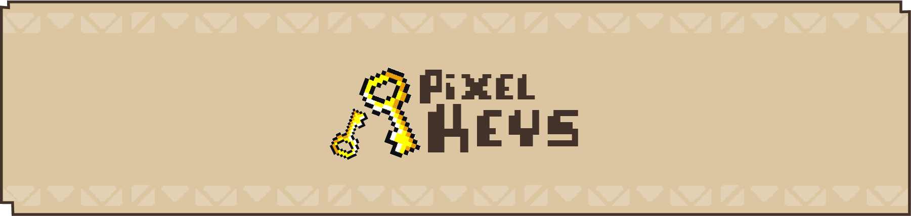
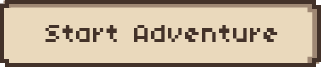
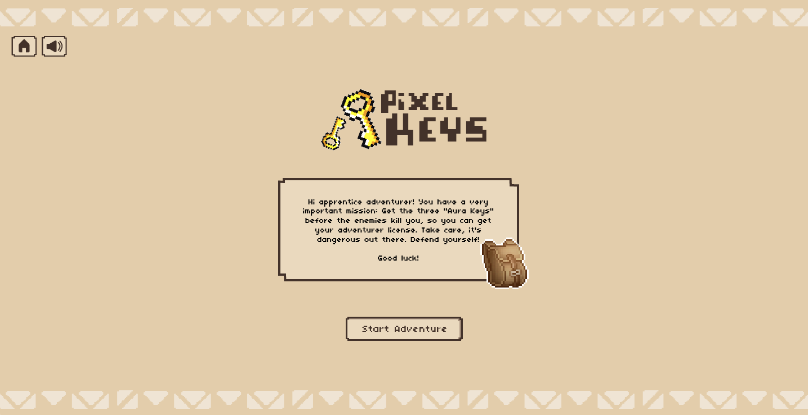
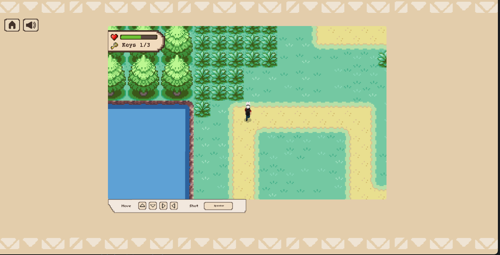
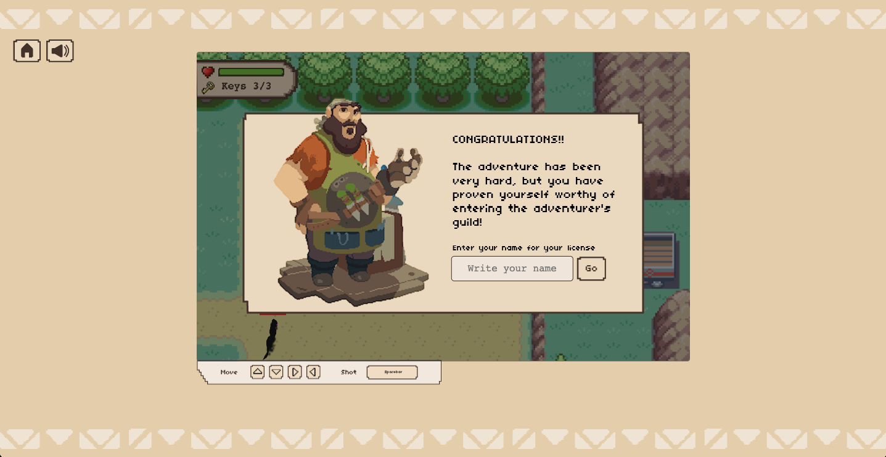
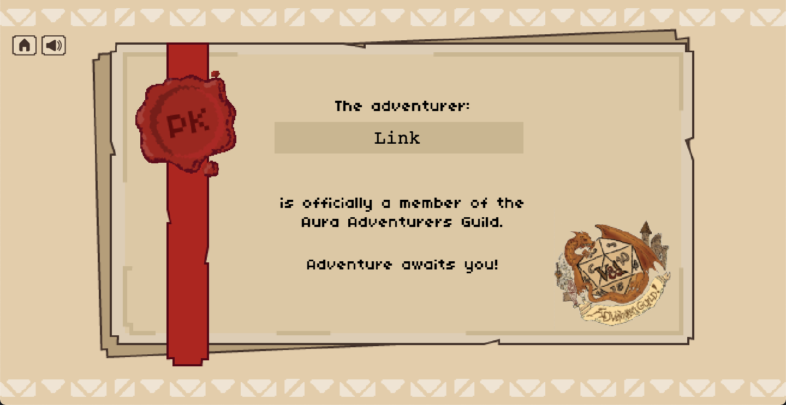
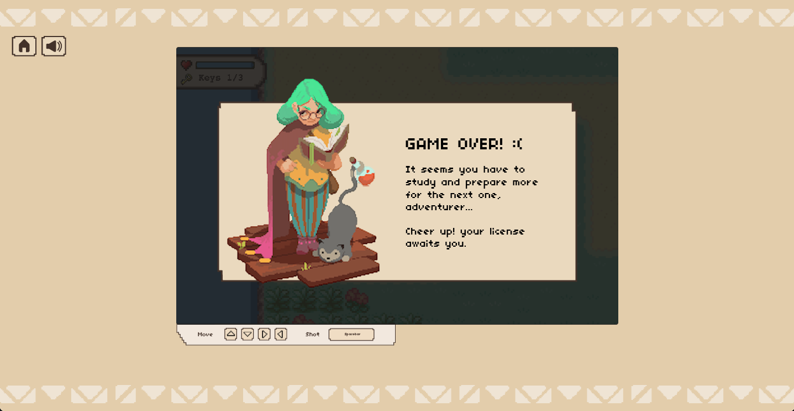

Pixel Keys is a little canvas game where you can move around the map. Try to kill all enemies and get three keys to get your adventurer license.
 

<!-- GETTING STARTED -->
# ⌨️ **Instructions**
Move around the map looking for the keys but be careful with the enemies, they will attack you when you pass near them!
  
The controls are very easy 
Move with:  A W S D 
Shot with the arrows:  ➡️ ⬅️ ⬆️ ⬇️  
 
 
Try yourself!
 

 

<!-- screenshot -->
## 🕹 **Screenshots**

 

 

<!-- Info -->
### 📜 **About Project**

Short game fully developed with canvas and JS. All the elements of the map have a movement with which we get the feeling of displacement. The character only gets the direction, it's the rest of the elements that move.

The player will be chased and attacked if he enters the enemy's range of action. If the player's life reaches 0, the game will end. Don't worry, you can recover life by collecting the hearts that are on the map.

Afeter obtaining the 3 keys, a small poster is displayed where we are congratulated and asked to enter our name in a form. That name is printed on a diploma certifying us as authentic (not really) adventurers.

### 🎯 **Built With**
* Vanilla JavaScript 
* Canvas
* HTML
* CSS
